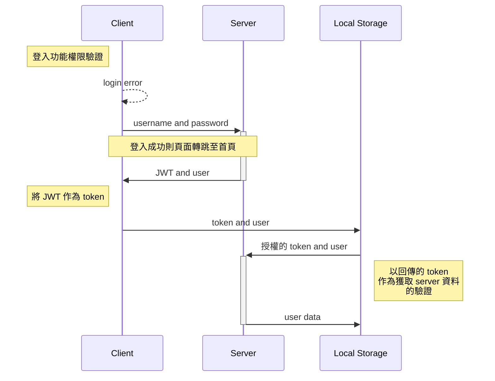
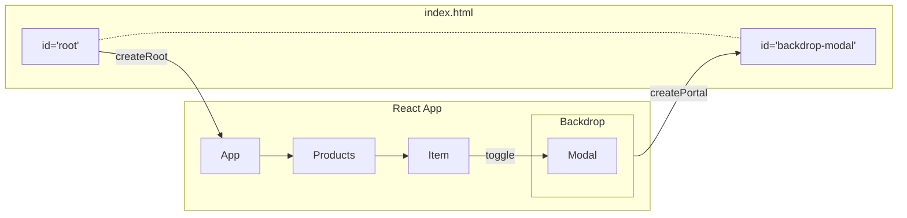
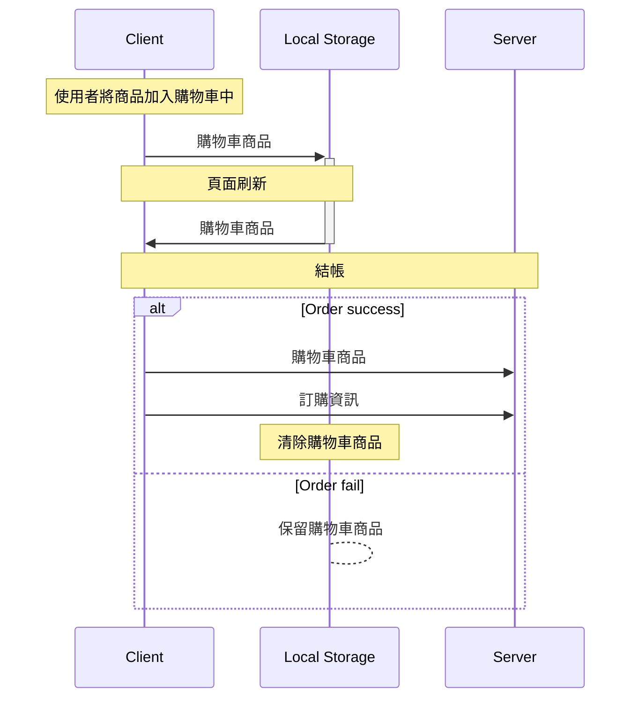
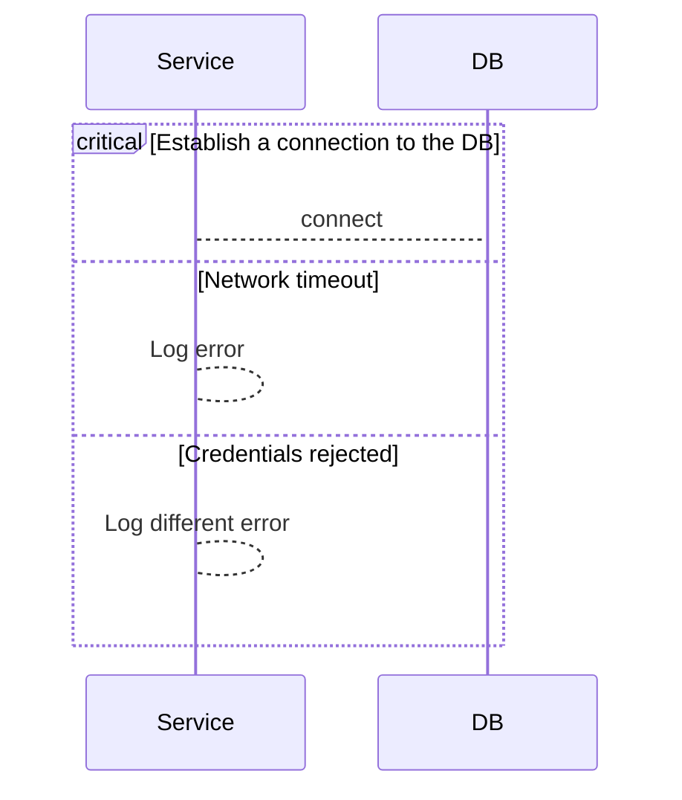

# Cake Shop

 > 本專案為一蛋糕購物網站前台，提供蛋糕愛好者既直觀又簡潔的購物環境。網站包含首頁、登入註冊頁面、商品頁面、購物車頁面、結帳頁面及訂單頁面。使用者可在結帳完成後，於使用者頁面查看所有歷史訂單。

## 開始購物！
- [購物網址](http://52.192.103.131/)
- 查看個人頁面可點選[網址](http://52.192.103.131/#/login)
  - **username:** admin
  - **password:** admin123
  
## 目錄
- [Cake Shop](#cake-shop)
  - [開始購物！](#開始購物)
  - [目錄](#目錄)
  - [工具](#工具)
  - [專案特點](#專案特點)
    - [登入頁面](#登入頁面)
    - [商品列表頁面](#商品列表頁面)
    - [購物車頁面、結帳頁面](#購物車頁面結帳頁面)
  - [Demo](#demo)
  - [作者](#作者)

## 工具
- React 18
- React Router v6 
- RTK Query
- Bootstrap
  
## 專案特點
- 登入頁面：登入成功後接收 server 回傳的 JWT 存放於 local storage 中作為權限驗證。
- 商品頁面：
  - 彈跳視窗：以 createPortal 方式渲染 backdrop 組件，作為點選查看資訊後呈現出 Modal 的效果。
  - 分頁功能：以 RTK 管理頁面狀態及使用 reducer 建立分頁按鈕點擊功能。
- 購物車頁面：使用 RTK Query 管理購物車內容，與 local storage 同步，實現刷新頁面還原購物車清單。
- 結帳頁面：使用  custom hook 實現可複用的驗證架構搭配 Regex ，簡潔的複用於任何驗證欄位。
- 訂單頁面：訂單完成後串接 API ，頁面發出請求更新訂單內容。 

### 登入頁面

### 商品列表頁面

### 購物車頁面、結帳頁面

## Demo
- 商品頁面彈跳視窗：

- 購物車畫面：可調整商品數量、刪除單項商品、清空所有商品及轉跳至結帳畫面

- 結帳畫面：右側呈現訂購的資訊及訂購明細

- 訂單畫面：有歷史訂單列表，以折疊式列表呈現訂單明細

## 作者
藍奕欣
[Github](https://github.com/ysl0628) 
Email: yihsinlan@gmail.com